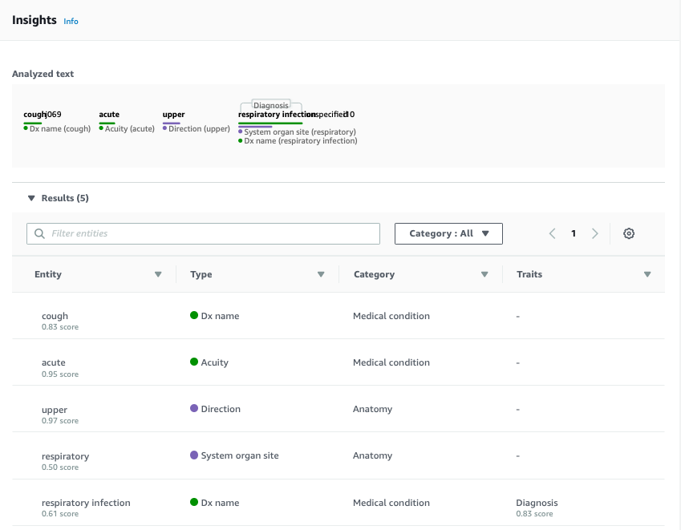

# Test AWS Comprehend Medical

Running synthetic chief complaints through AWS Comprehend Medical.

Using Scott Lee's public data sets from <https://gitlab.com/gte577z/ml-workshop>

Question- how does CM diagnosis compare to process that generated these codes using the process described in [Scott's paper](https://www.nature.com/articles/s41746-018-0070-0)? Using the set of 42,364 synthetic chief complaints and HCUP CCS diagnosis codes.

## References

[CCS Users Guide with descriptions of 259 diagnosis categories](https://www.hcup-us.ahrq.gov/toolssoftware/ccs/CCSUsersGuide.pdf)
[AWS CM Docs](https://docs.aws.amazon.com/comprehend/latest/dg/comprehend-medical.html)
[AWS CM API Docs](https://docs.aws.amazon.com/comprehend/latest/dg/API_Reference.html)
[AWS CM Python Boto3 Docs](https://boto3.amazonaws.com/v1/documentation/api/latest/reference/services/comprehendmedical.html)

## Screenshots

