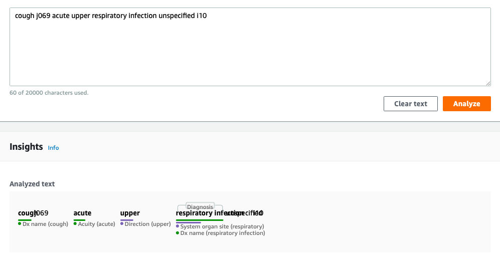
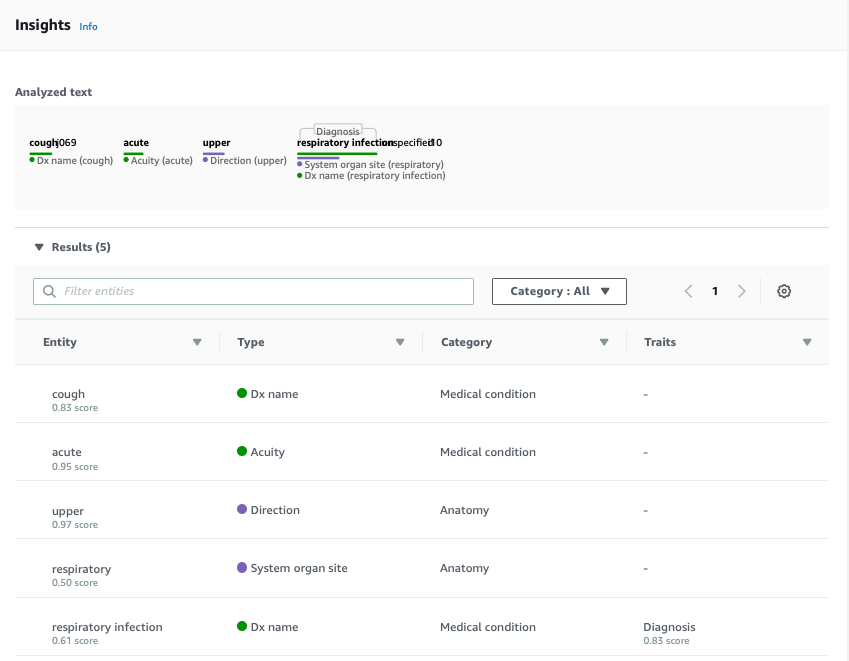

# Test AWS Comprehend Medical

Running synthetic chief complaints through AWS Comprehend Medical.

Using Scott Lee's public data sets from <https://gitlab.com/gte577z/ml-workshop>

Question- how does CM diagnosis compare to process that generated these codes using the process described in [Scott's paper](https://www.nature.com/articles/s41746-018-0070-0)? Using the set of 42,364 synthetic chief complaints and HCUP CCS diagnosis codes.

## Results

Multiple different types of entity types found ['SYSTEM_ORGAN_SITE', 'DX_NAME', 'ACUITY', 'DIRECTION', 'ID', 'PROCEDURE_NAME', 'TEST_NAME', 'TREATMENT_NAME', 'PHONE_OR_FAX', 'GENERIC_NAME', 'ADDRESS', 'BRAND_NAME', 'DATE', 'NAME', 'PROFESSION']

Multiple different types of entity categories found ['ANATOMY', 'MEDICAL_CONDITION', 'PROTECTED_HEALTH_INFORMATION', 'TEST_TREATMENT_PROCEDURE', 'MEDICATION']

Multiple different types of trait names found ['SYMPTOM', 'DIAGNOSIS', 'SIGN', 'NEGATION']

Multiple different tuples of type, caegory, trait found [('DX_NAME', 'MEDICAL_CONDITION', 'SYMPTOM'), ('DX_NAME', 'MEDICAL_CONDITION', 'DIAGNOSIS'), ('DX_NAME', 'MEDICAL_CONDITION', 'SIGN'), ('DX_NAME', 'MEDICAL_CONDITION', 'NEGATION')]

## Requirements

Remember to [configure your local environment](https://docs.aws.amazon.com/cli/latest/userguide/cli-chap-configure.html#cli-quick-configuration) with an aws access key, secret key, and default region. Entire exploration done using free tier (thanks AWS) and in the us-east-1 region, although I don't think that matters.

## References

[CCS Users Guide with descriptions of 259 diagnosis categories](https://www.hcup-us.ahrq.gov/toolssoftware/ccs/CCSUsersGuide.pdf)
[AWS CM Docs](https://docs.aws.amazon.com/comprehend/latest/dg/comprehend-medical.html)
[AWS CM API Docs](https://docs.aws.amazon.com/comprehend/latest/dg/API_Reference.html)
[AWS CM Python Boto3 Docs](https://boto3.amazonaws.com/v1/documentation/api/latest/reference/services/comprehendmedical.html)

## Screenshots





## Data Maps

```json
[
    {
        "data-source": "ML-Workshop-Synthetic-Chief-Complaints",
        "data-owner": "https://gitlab.com/gte577z",
        "data-custodian": "https://gitlab.com/gte577z",
        "address": "https://gitlab.com/gte577z/ml-workshop/raw/master/data/text.csv",
        "extract-date": "2018-12-20",
        "format": "CSV",
        "methods": "https://doi.org/10.1038/s41746-018-0070-0",
        "fields": [
            "text",
            "diagnosis"
        ]
    },
    {
        "data-source": "AWS-Medical-Comprehend-Assess-Chief-Complaints",
        "data-owner": "OCIO",
        "data-custodian": "OCIO",
        "address": "https://github.com/leebrian/aws-cm-test/blob/master/dat/text-acm.csv",
        "format": "CSV",
        "methods": "https://github.com/leebrian/aws-cm-test",
        "tags": [
            "AWS",
            "Comprehend Medical"
        ],
        "fields": [
            "text",
            "diagnosis",
            "aws-text",
            "aws-score",
            "aws-category",
            "aws-category",
            "aws-trait"
        ],
        "upstream": "ML-Workshop-Synthetic-Chief-Complaints"
    }
]
```
